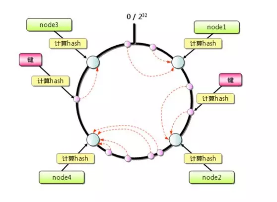
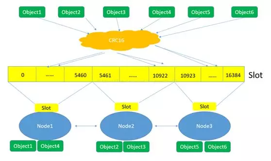
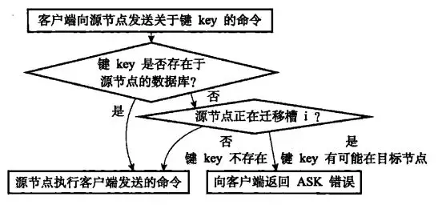

# Redis集群(Redis Cluster)

**注: Redis集群需要Redis3.0及以上版本**

---

更详细的信息可以参照

[docker 搭建redis-slave集群](https://segmentfault.com/a/1190000010131816)

[docker 搭建redis-cluster集群说明](https://www.jianshu.com/p/b7dea62bcd8b)

[docker 搭建redis-cluster](./redis-cluster)

[Redis Cluster 添加/删除 完整折腾步骤](http://blog.51cto.com/hsbxxl/1965706),

[Redis集群官方教程](https://redis.io/topics/cluster-tutorial)

---

## 数据分区及优点

 数据分区(数据分片)是集群最核心的功能，集群是将数据分散到多个节点：

* 突破Redis单机内存大小的限制，有效的规避由于数据量过大导致的单机内存溢出的问题，数据存储容量大大增加
  * 单机内存过大，bgsave 和 bgrewriteaof 的fork操作可能导致主进程阻塞，主从环境下主机切换时可能导致节点长时间无法提供服务，全量复制阶段主节点的复制缓冲区可能出现溢出问题。 
* 每个主节点都可以提供对外的读写服务器，可以极大的提高应用的响应能力
* 集群通过自动故障转移来实现高可能的效果，当任意一个节点发生故障时，集群依然可以提供对外服务。（单一节点宕机不会影响服务的正常使用，与哨兵类似，但是是通过应用漂移而非主从切换实现的）

---

## 集群的搭建

### 使用Redis命令搭建

 集群的搭建主要分为四步：

 > * **启动节点：** 将节点以集群模式启动，启动的各个节点单独独立。
 > * **节点握手：** 让独立的节点连成统一的网络
 > * **分配槽：** 将对应的槽分配给主节点（16384）
 > * ***指定主从关系：*** 为从节点指定主节点 （最后一步是为了实现哨兵模式，主从依赖实现更优的高可用服务）

#### 启动节点

 集群的节点启用与正常redis启用完全相同，只需要将对应的配置文件改成集群模式即可

 ``` conf
 # redis.conf 
 # 启用集群的核心配置
 port 7000
 cluster-enabled yes
 cluster-config-file "node-7000.conf"
 logfile "log-70000.log"
 dbfilename "dump-7000.rdb"
 daemonize yes
 ```

 其中集群的两个最主要的配置为cluster-*。

 **cluster-enabled**：Redis实例可以分为单机模式(standalone)和集群模式(cluster)，该配置设置使Redis以集群模式启动

 Redis启动后，可以执行info server命令来查看Redis的模式

 ``` info
 redis_mode:cluster 集群模式
 redis_mode:standalone 单机模式
 ```

**cluster-config-file**：该参数指定了运行过程中，动态维护的配置文件的位置。当集群详细发生变化的时候(增减节点),集群内所有节点都会将最近的集群信息更新到该配置文件中。当该节点以集群模式重新启动的时候，会重新读取配置文件，获取集群信息并将自己加入到集群中。

节点启动后，通过cluster nodes命令```redis-cli -p 7000 cluster nodes ```可以查看该节点的情况。会返回如下信息。
``` 
节点ID(由40个16进制字符串组成)：port myself,master - 0 0 0 connected
```
节点ID会在集群初始化的时候创建一次，然后保存到刚刚上文提到的集群配置文件中，以后会优先读取集群配置文件中的id

##### 节点握手

节点启动后是互相独立的，互相并不知道其他节点的存在；需要通过节点握手的方式，将各个独立的节点汇聚成一个统一的网络。

节点握手使用 ```redis-cli -p 7000 cluster meet {ip} {port} ``` 命令来实现。

之后执行 ``` redis-cli -p 7000 cluster nodes ``` 就可以看到另外一个节点的存在

##### 分配槽

槽是Redis集群中用来实现数据分区，同时做数据管理和数据迁移的基本单位。Redis集群固定有16384个槽。

需要为数据库中所有16384个槽都分配节点，只有所有的槽都分配了节点，集群才能正式生效（ok），一旦任意有一个槽没有分配节点，则集群就将处于下线状态（fail）。

使用``` redis-cli -p 7000 cluster info ``` 可以查看集群状态,可以看到如下的结果

``` info
cluster_state:fail #集群的状态
cluster_slots_assigned:0 #已分配的槽数量
```

使用```redis-cli -p 7000 cluster addslots {startlots,endlots} ```为指定的主节点来分配槽。将 0~16383 全部分配完成后，再执行cluster info后可以看到一下状态

``` info
cluster_state:ok #集群成功
cluster_slots_assigned:16384 #已分配的槽数量
```

##### _指定主从关系_

集群的主从关系不再使用slaveof，而应该使用cluster replicate来指定主从关系。

``` sh
redis-cli -p 8000(从节点) cluster replicate 主节点ID
```

###### 至此，集群搭建完毕

---

#### 使用Ruby脚本搭建集群

Redis 提供了Ruby脚本来实现自动化集群搭建，{REDIS_HOME}/src 目录下可以找到redis-trib.rb 文件

##### 安装Ruby环境

windows和linux安装方法不同

##### 启动节点

与上文启动节点方法完全相同

##### 搭建集群

redis-trib.rb 脚本提供了若干命令，可以参照[redis cluster管理工具redis-trib.rb详解](https://blog.csdn.net/huwei2003/article/details/50973967)，其中create是用来搭建集群的。

``` sh
./redis-trib.rb create --replicate 1 {ip:port}s
```

其中replicate 1 指的是每个主节点有一个从节点；{ip:port}是对应redis服务器的ip和端口，中间使用空格分割。

使用该命令创建集群的时候，需要通过如下检查：

* 要求主从节点之间中不能包含任何槽和数据
* 检查传入的master节点数量，数量必须大于等于3才能组成集群

检查通过后脚本会给出创建集群的计划，验证无误后输入yes就可以创建一个集群了

**至此，集群搭建完毕**

 ---

## 集群方案设计

**设计集群方案时，至少需要考虑一下因素**

* **高可用**：根据[故障转移的原理](#cluster-principle)，需要至少3个节点才能完成故障转移(这也是Ruby对master数量验证的主要原因)；每一个主节点最好至少配备一个从节点，防止主节点宕机后无法完成剩余节点的故障转移；另外每一个节点都分属不同的物理机，防止多节点同时宕机。
* **数据量和访问量**:估算应用的数据量和总访问量，结合每个主节点的容量和能承受的访问量（可以使用benchmark来估计），同时最好留有冗余。
* **尽量避免大集群**：Redis官方给出的节点最大数量为1000，主要是考虑节点之间通信带来的性能消耗问题。在实际应用过程中，应尽量避免大集群，如果节点数量不足以满足数据量及访问量的需求时，可以考虑
  * 业务分割，使用微服务来将大集群转换为小集群
  * 减少不必要的缓存数据，避免对Redis的频繁访问，降低数据量和网络通信的性能损耗
  * 调整数据过期策略，均衡数据过期及网络通信之间的性能问题
* **适度冗余**：考虑到业务增长，可适当增加节点数量，但不应过大

---

<span id="cluster-principle"></span>

## 集群的基本原理

### 数据分区方案

数据分区主要有顺序分区，哈希分区等。由于哈希分区具有天然的随机性，应用广泛；Redis集群的分区方案就是哈希分区的一种。

哈希分区的基本思想是:基于数据的特征值(Redis中使用的是数据的Key)进行哈希，然后根据哈希值来决定数据的落点。

常见的哈希分区包括：哈希取余分区，一致性分区，带虚拟节点的一致性哈希分区等方案。

>衡量数据分区方法好坏的主要因素为以下两个

 >* 数据分布是否均匀
 >* 增删节点对数据分布的影响及数据调整的成本。

对于哈希分布来说，数据是否分布均匀取决于哈希算法和对应关键值(Key)的哈希计算结果，所以第一点不在衡量哈希算法的范围内，评估哈希分区算法的主要关键点放在第二点上。

#### 哈希取余分区

哈希取余分区的思想类似于java中HashMap命中table的思想，分区命中特别简单：

 >* 计算key的Hash值
 >* 基于节点数量进行取余
 >* 将数据放置到余数指向的节点中
 
这样的命中规则带来的最大的问题就是，每当节点数量发生变化时，所有Hash值得余数都需要重新计算，才能确定该条数据会被分配到哪一个节点上。

#### 一致性分区

一致性分区使用的是环的思想



如上图，将hash值按照算法规则做枚举，利用枚举值组成一个环，根据key值计算得到对应的hash值后找到其在环上的位置，之后依据约定好的向前/向后的规则就能得到该值应该附着在哪一个节点上了。

一致性分区能有效的节约节点数量变化的再取余计算，但是一致性分区在中途删除节点的时候容易出现大量值附着在同一个节点的问题。如图，当node2被删除时，对应的数据会被迁移到node4上，造成node4的数据量过大。

#### 带虚拟节点的一致性分区

该方案即为Redis集群采用的数据分区方案

该方案是对一致性分区方案的改进，基本思想不变，只是在原基础上添加了虚拟节点(Redis中的slot)的概念。

槽(slot)可以看作是节点的子集，槽在初始化后数量不允许发生变化，可以有效的减少增删节点带来的数据迁移造成的性能损耗，同时也规避了在删除节点时带来的节点值数量严重不平衡的问题。

引入槽以后，数据的映射关系由数据 hash->实际节点，变成了**数据 hash->槽->实际节点**。在使用了槽的一致性哈希分区中，槽是数据管理和迁移的基本单位。槽解耦了数据和实际节点之间的关系，增加或删除节点对系统的影响很小。槽的数量一般远小于 2^32，远大于实际节点的数量；在 Redis 集群中，槽的数量固定为 16384个。



如上图所示，集群的实际管控者需要调整槽和节点的关系，来保证节点中hash值得稳定性。

### 节点通信机制

#### 两个端口

在哨兵系统中，节点被分为数据节点和哨兵节点;前者存储数据，后者实现额外得控制功能。

在集群中，由于所有得节点都应该参与数据得存储和集群的状态维护。所以在集群系统中，使用两个TCP接口来满足通信需求

 >* **普通端口：** 指定一个普通开放端口，用于为客户段提供服务；该端口也用于调整slot时候的数据迁移。
 >* **集群接口：** Redis规定，集群端口的端口号需为普通端口+10000(10000是固定值,需注意对应端口的开放情况),集群端口用于节点之间的通信，方便节点之间沟通集群情况和节点健康性。

#### Gossip协议

 Redis节点之间的通信使用的是Gossip协议
 > Gossip协议的特点是，在节点数量有限的网络中，每个节点都安照一定规则，通信其中的部分节点，这样经过一段杂乱无章的通信后，每个节点的状态可以很快达到一致

Gossip协议相对于广播而言，具有去负载，去中心化，容错率高(Gossip协议要求各节点之间的通信需要存在冗余，及同一个节点需要能收到多个节点的通信信息)；但是此类通信的收敛速度慢，不能达到一次通信，全局变更。

#### 消息类型

节点间通信的消息主要包含以下5类

>* MEET 消息
>* PING 消息
>* PONG 消息
>* FAIL 消息
>* PUBLISH 消息

不同的消息类型，通信协议、发送的频率和时机、接收节点的选择等是不同的：

>* MEET 消息：在节点握手阶段，当节点收到客户端的 cluster meet 命令时，会向新加入的节点发送 MEET 消息，请求新节点加入到当前集群；新节点收到 MEET 消息后会回复一个 PONG 消息。
> * PING 消息：集群里每个节点每秒钟会选择部分节点发送 PING 消息，接收者收到消息后会回复一个 PONG 消息。PING 消息的内容是自身节点和部分其他节点的状态信息；作用是彼此交换信息，以及检测节点是否在线。PING 消息使用 Gossip 协议发送，接收节点的选择兼顾了收敛速度和带宽成本，具体规则如下：<br/>
  1、 随机找 5 个节点，在其中选择最久没有通信的 1 个节点。<br/>
  2、 扫描节点列表，选择最近一次收到 PONG 消息时间大于 cluster_node_timeout/2 的所有节点，防止这些节点长时间未更新。
>* PONG 消息：PONG 消息封装了自身状态数据。可以分为两种：第一种是在接到 MEET/PING 消息后回复的 PONG 消息；第二种是指节点向集群广播 PONG 消息。这样其他节点可以获知该节点的最新信息，例如故障恢复后新的主节点会广播 PONG 消息。
>* FAIL 消息：当一个主节点判断另一个主节点进入 FAIL 状态时，会向集群广播这一 FAIL 消息；接收节点会将这一 FAIL 消息保存起来，便于后续的判断。
>* PUBLISH 消息：节点收到 PUBLISH 命令后，会先执行该命令，然后向集群广播这一消息，接收节点也会执行该 PUBLISH 命令。

---

## 客户端访问集群

**应用可以通过任意一个节点访问整个集群**

在集群中，数据分布在不同的节点中，客户端在某节点访问数据时，数据可能不在该节点中；下面介绍集群是如何处理这个问题的。

### Dummy客户端

包括redis-cli在内的执行命令前不能确定数据到底在哪个节点上，需要借助 **MOVED** 错误重新定向的客户端，被称为Dummy客户端。

对应客户端访问方式分为以下几步：

* 计算key值所在的slot(等同于``` cluster keyslot ```函数) CRC16(key)&16383 算法
* 判断对应的slot是否存在于当前节点上。
  * 如果在当前节点上，则在当前节点执行查询操作，并返回数据 
  * 如果不在当前节点上，则包装成 **MOVED** 错误返回，同时在 **MOVED** 错误中包含正确的节点IP和port。Dummy客户端在得到 **MOVED** 错误后，基于其中的ip和port访问正确的节点后再执行最开始的一步。

### Smart客户端

smart客户端是和dummy相对的一类客户端(以JedisCluter为例)，再访问集群前会先计算出对应的slot,同时利用客户端的节点快照(临时缓存)，找到正确的节点，执行查询操作。

接下来以 JedisCluster  为例，展示一下如何命中对应的值

* **初始化过程:** JedisCluster在初始化的时候会访问集群的配置文件，将节点的slots作为快照存储在客户端中。另外，同时创造与各个节点的连接池，方便快速访问对应节点。
* **查询过程:** 使用``` cluster keyslot ```命令得到对应的slot，然后依据快照直接访问对应的节点。
  * 命中成功。
  * 命中失败，得到MOVED错误后重新访问集群的配置文件，创建新的快照。然后返回查询过程的开始，再执行一次。

* 使用JedisCluster时需要注意如下事项：
  * JedisCluster 中已经包含所有节点的连接池，因此 JedisCluster 尽可能使用单例。否则会出现多线程下，配置不统一的问题，同时也会对服务器的性能产生较大的影响。
  * 客户端维护了 slot->node 映射关系以及为每个节点创建了连接池，当节点数量较多时，应注意客考量户端内存资源和连接资源的消耗问题，防止出现OOM及系统宕机的风险。

---

## 其他事项

### 集群伸缩

集群伸缩是集群系统中最经常遇到的需求。而且由于用户业务量的增加，常以增加节点为主。接下来介绍一下增减点的方法。增删节点由于涉及到槽及数据迁移的工作，所以以下的部分全部建议使用redis自带的redis-trib.rb工具来完成。

#### 增加节点

* 启动新的节点服务器
* 节点握手： 使用``` cluster meet ```命令来实现，或使用redis-trib.rb中的 ``` redis-trib.rb add-node 新服务器ip:端口 原集群 ```来实现。其原理也是使用的 ``` cluster meet``` 命令来实现的，但是它会优先检查新节点的集群状况或是否存在其他数据，避免未经检查导致的集群混乱问题。
* 槽迁移：同时建议使用 ``` redis-trib.rb reshard 任意ip:对应port```来实现slot分配及转移的效果。
* 指定主从关系

#### 减少节点

* 槽迁移：同样建议使用 ``` redis-trib.rb reshard 任意ip:对应port```来实现slot分配及转移的效果。
* 下线节点：建议使用``` redis-trib.rb del-node 任意ip:对应port {需要下线的节点id} ```

#### ASK错误

ASK错误的发生是在槽迁移的时候，客户端发送了增删改查请求导致的，只要请求涉及到的槽正处于迁移过程中均会收到此错误。



类似于 MOVED 错误，dummy客户端会重新发送请求，但是对于smart客户端而言，两者具有很大的区别。当smart客户端再收到两种错误的时候都会重新发送请求，但是收到ASK错误后smart客户端不会重新创建快照，因为ASK请求是临时的，只有迁移工作完成后，客户端重新收到MOVED请求后才会重新刷新集群快照。

### Hash Tag

Hash Tag 的原理时： 当Redis在计算key的hash值的时候，如果key中包含了 {} 的时候，仅会计算 {} 中的字符串。这样Hash Tag 可以让不同的key值拥有同一个hash值，从而分配到同一个槽中。这样就能有效避免由于集群分槽导致的一些批量操作不可用的问题。

**注意：** Hash Tag的滥用可能会导致Redis集群出现严重的数据分配不均问题，导致集群失去原有的效果。

### redis-trib.rb

redis-trib.rb 提供了众多实用工具：创建集群、增减节点、槽迁移、检查完整性、数据重新平衡等；可以通过 help 命令可以查看详细信息。

建议在正式应用服务器中如果能使用 redis-trib.rb 工具则尽量使用该工具，不但方便快捷，还可以大大降低出错概率。

[Other](https://mp.weixin.qq.com/s/oDllfcVc5_ekIFP66kRP9w)
