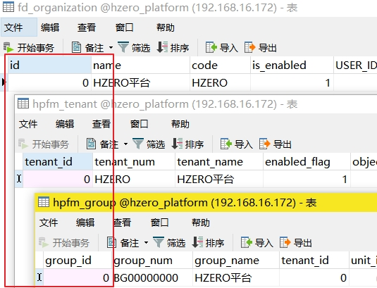
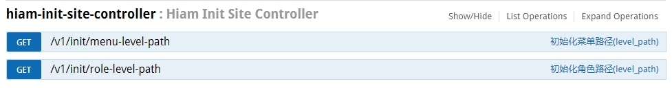
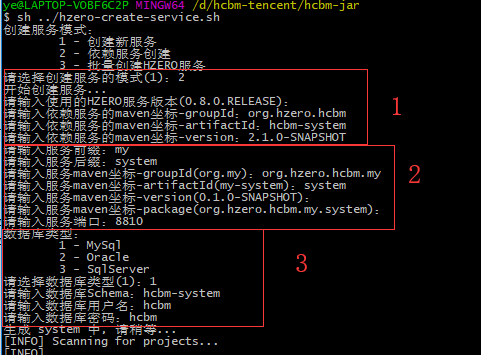

# HCBM项目通过maven引入部署

## Hcbm相关服务介绍<span id="hcbm-info"></span>

| 组件| 描述 | 默认端口 | 版本 |
| --- | --- | --- | --- | --- |
| hzero-register | 组件注册中心 | 8000 | 0.8.0.RELEASE |
| hzero-swagger | Swagger测试服务 | 8050 | 0.8.0.RELEASE |
| hzero-config | 配置服务 | 8010 | 0.8.0.RELEASE |
| hzero-gateway | 网关服务| 8080 | 0.8.0.RELEASE |
| hzero-gateway-helper | 鉴权服务 | 8090 | 0.8.0.RELEASE |
| hzero-oauth | 认证服务 | 8020 | 0.8.0.RELEASE |
| hzero-asgard | 事务服务 | 8040 | 0.8.0.RELEASE |
| hzero-iam | IAM服务 | 8030 | 0.8.0.RELEASE |
| hzero-platform | 基础平台服务 | 8100 | 0.8.0.RELEASE |
| hzero-workflow | 工作流服务 | 8160 | 0.8.0.RELEASE |
| hzero-workflow-edit | 工作流设计服务 | 8170 | 0.8.0.RELEASE |
| hzero-message | 消息服务 | 8120 | 0.8.0.RELEASE |
| hzero-file | 文件服务 | 8110 | 0.8.0.RELEASE |
| hzero-interface | 接口服务 | 8150 | 0.8.0.RELEASE |
| hcbm-system | 合同基础设置服务 | 8810 | 2.1.0-SNAPSHOT |
| hcbm-contract | 合同拟制服务 | 8330 | 2.1.0-SNAPSHOT |
| hcbm-change | 合同变更服务 | 8870 | 2.1.0-SNAPSHOT |
| hcbm-execute | 合同变更服务 | 8880 | 2.1.0-SNAPSHOT |
| hcbm-sign | 合同签署服务 | 8860 | 2.1.0-SNAPSHOT |
| hcbm-semantics | 语义分析服务 | 8890 | 2.1.0-SNAPSHOT |
| hcbm-template | 合同模板分析 | 8840 | 2.1.0-SNAPSHOT |
| hcbm-mdata | 合同主数据服务 | 8890 | 2.1.0-SNAPSHOT |

## 基础环境安装

参照[Hzero基础环境安装](http://hzerodoc.saas.hand-china.com/zh/docs/installation-configuration/service-install/local-install/)至数据初始化前

## 数据初始化

参照[创建数据库](http://39.106.218.207:1313/zh/docs/deploy/hcbm/createdatabase/)先创建好需要的hcbm服务对应的数据库。

然后请联系Hcbm项目组，索要最新的初始化项目，来初始化数据库数据。

**注意**
1、数据初始化结束后需要检查如下内容

由于不同数据库的主键自增机制不同，无法初始化相关租户的id，所以默认租户id为0，在数据初始化结束后，需要检查上图三个表中的id，将其调整为0。

2、在[使用jar包引入部署项目](#jar-run)完成后，需使用swagger(http://ip:8080/swagger/swagger-ui.html#/)调用IAM服务的初始化接口进行一些初始化操作。


## 使用jar包引入部署项目<span id="jar-run"></span>

### 准备工作

* 下载maven骨架目录文件[archetype-catalog.xml](http://hzerodoc.saas.hand-china.com/files/docs/installation-configuration/service-create/archetype-catalog.xml)，放在maven仓库位置,基于该文件，maven可以找到相关jar的下载仓库
  * windows默认为 C:\Users\{userName}\.m2\repository
  * linux/mac默认为 ~\.m2\repository
* 下载[运行脚本](http://hzerodoc.saas.hand-china.com/files/docs/installation-configuration/service-create/hzero-create-service.sh)
* 由于脚本为sh脚本，为方便直接运行，建议windows用户下载相关的sh运行工具，推荐使用[cygwin](https://www.cygwin.com/install.html)
* mac用户需安装 gnu-sed，并设置环境变量
  * 安装软件：
    ```brew install gnu-sed coreutils```
  * 设置环境变量：
  
    ``` sh
    export MANPATH="/usr/local/opt/gnu-sed/libexec/gnuman:/usr/local/opt/coreutils/libexec/gnuman:$MANPATH"
    export PATH="/usr/local/opt/gnu-sed/libexec/gnubin:/usr/local/opt/coreutils/libexec/gnubin:$PATH"
    ```

### 创建依赖服务
  
执行sh脚本

如上图，执行过程需要填写参数分为三部分

* 第一部分为需要依赖的服务信息，具体填写情况请查看[Hcbm相关服务介绍](#hcbm-info)
* 第二部分为本地服务的相关消息，请按照实际情况填写
* 第三部分为数据库相关信息，请选择对应的数据库类型并依据创建的数据库填写准确的数据库信息

创建完成后，还需要手动处理一些配置，对比依赖的 jar 包中的如下类或配置文件，尽量与依赖的服务保持一致

* 修改pom文件，替换其中的仓库信息
  
  ``` xml
  <repository>
      <id>hcm-releases</id>
      <name>Hcm Releases</name>
      <url>http://nexus.saas.hand-china.com/content/repositories/hcm-releases</url>
      <snapshots>
          <enabled>false</enabled>
      </snapshots>
  </repository>
  <repository>
      <id>hcm-snapshots</id>
      <name>Hcm Snapshots</name>
      <url>http://nexus.saas.hand-china.com/content/repositories/hcm-snapshots</url>
      <releases>
          <enabled>true</enabled>
          <updatePolicy>always</updatePolicy>
      </releases>
  </repository>
  <!--如有需要使用Aspose的部分需要添加此仓库-->
  <repository>
      <id>AsposeJavaAPI</id>
      <name>Aspose Java API</name>
      <url>http://artifact.aspose.com/repo/</url>
  </repository>
  ```

* 修改pom文件
  
  ```xml
  <!--hzero开头的服务依赖此parent-->
  <parent>
      <groupId>org.hzero</groupId>
      <artifactId>hzero-parent</artifactId>
      <version>0.8.0.RELEASE</version>
  </parent>
  <!--hcbm开头的服务依赖此parent-->
  <parent>
      <groupId>org.hzero.hcbm</groupId>
      <artifactId>hcbm-parent</artifactId>
      <version>2.1.0-SNAPSHOT</version>
  </parent>
  ```

* Application 启动类
* charts/service_name/values.yaml
* resources/application.yml
* resources/bootstrap.yml

同时基于此方法生成的项目会包含一些Dome类及mapper.xml文件，无实际需要请删除

## 服务启动

``` sh
#!/usr/bin/env bash

# 刷新环境变量
source /etc/profile
source ~/.bash_profile

startDir='/hcbm'
dirName='hcbm-system'
appName='system'
port=8810

# 应用打包
mvn clean package -U -DskipTests=true

# 根据端口号查询对应的pid，并删除服务进程
pid=$(netstat -nlp | grep :$port | awk '{print $7}' | awk -F"/" '{ print $1 }');
echo $pid
if [  -n  "$pid"  ];  then
    kill  -9  $pid;
fi

# 删除老文件，复制新文件
rm $startDir/app/$appName.jar -f
rm $startDir/logs/$appName.log -f
mv ./target/app.jar $startDir/app/$appName.jar

# 启动项目
cd $startDir/
nohup java -jar -Dspring.profiles.active=develop \
-Dspring.cloud.config.enabled=false \
-Xms512m -Xmx1024m \
 ./app/$appName.jar > ./logs/$appName.log &
tail -f ./logs/$appName.log
```

以上为一个服务快速启动的sh脚本，请按需调整对应的startDir,dirName,appName,port参数，然后执行即可。