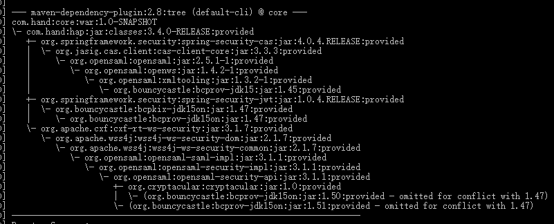

# Tomcat启动时出现Jar包互相依赖的问题

该问题主要出现，使用Linux/Mac系统打的war包来启动项目的过程中，且出现较为随机。

使用windows系统打的war包发布到linux系统目前尚未出现该问题。

猜测可能Windows下的Maven在打包过程中对依赖的处理方式与Linux略有不同。Linux/Mac下的Maven在处理重复依赖的时候存在Bug

---

Tomcat在启动war项目的时候，出现如下报错
``` log
Caused by: java.lang.IllegalStateException: Unable to complete the scan for annotations for web application [/ect] due to a StackOverflowError. Possible root causes include a too low setting for -Xss and illegal cyclic inheritance dependencies. The class hierarchy being processed was [org.bouncycastle.asn1.ASN1EncodableVector->org.bouncycastle.asn1.DEREncodableVector->org.bouncycastle.asn1.ASN1EncodableVector]
```

依照该报错可以看到，两组信息

>* ```root causes include a too low setting for -Xss and illegal cyclic inheritance dependencies``` -Xss堆栈内存过小是导致该异常出现的直接原因
>* ```[org.bouncycastle.asn1.ASN1EncodableVector->org.bouncycastle.asn1.DEREncodableVector->org.bouncycastle.asn1.ASN1EncodableVector]``` 可以看出 ASN1EncodableVector->DEREncodableVector 两个类递归引用，没有出口导致的堆内存溢出。

所以需要解决的是对ASN1EncodableVector，DEREncodableVector包的引用问题，这种互相引用往往是因为Maven/Grails在使用不同的组件时，这些组件分别引用了两个版本的JAR引起的。

Maven项目使用 ``` mvn dependency:tree -Dverbose -Dincludes=org.bouncycastle ```可以查看具体引用了哪些版本的jar包,可以看到如下结果：



可以看到项目中分别引用了
> bcprov-jdk15 <br/>
> bcprov-jdk15on

---

### 解决方法1：
可以修改Maven依赖，调整依赖版本，将两个jar包的版本统一

### 解决方法2：
Tomcat jarScanner提供了可插拔的特性，允许通过修改 ``` ~tomcat/conf/catalina.properties```来忽略扫描某些jar包
>* Tomcat 7 中，在```org.apache.catalina.startup.ContextConfig.jarsToSkip``` 属性下增加```bcprov*.jar,\```
>* Tomcat 8 及以后版本，在```tomcat.util.scan.StandardJarScanFilter.jarsToSkip``` 属性下增加```bcprov*.jar,\```

---

参考[stackoverflow](https://stackoverflow.com/questions/29955410/how-do-i-fix-stackoverflowerror-in-org-apache-catalina-startup-contextconfig-pop)