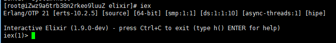

# 在Centos7环境下安装RabbitMq

---
**安装环境**

本次安装基于以下环境安装
* 阿里云
* CentOS 7.3

---
**安装过程**
1、由于RabbitMq是基于Erlang开发的，所以需要先安装Erlang环境
``` sh
# Centos官方镜像尚未更新版本，Erlang版本较老，所以这里使用wget+npm方式安装Erlang环境
# 可以访问 https://packages.erlang-solutions.com/erlang/ 获取最新程序包
wget http://packages.erlang-solutions.com/site/esl/esl-erlang/FLAVOUR_1_general/esl-erlang_16.b.3-1~centos~6_amd64.rpm
#安装相关依赖
sudo yum install libGL libGLU wxBase wxGTK wxGTK-gl libiodbc unixODBC
#安装erlang
rpm -Uvh esl-erlang_16.b.3-1_centos_6_amd64.rpm
# 安装完成后执行以下命令测试
erl
```


出现如上界面，则说明erlang安装成功
``` erlang
halt() . #退出
```

2、安装Elixir
由于镜像中的Elixir版本太旧，所以通过源码编译的方式安装
``` sh
# 安装git
sudo yum install git
# 克隆源码
git clone https://github.com/elixir-lang/elixir.git
# 编译
cd elixir
make clean test
# 编译完成后会看到类似如下学信息
##############################################################
## Finished in 59.4 seconds (31.4s on load, 27.9s on tests) ##
##############################################################
# 测试是否安装成功
iex
```


出现如上界面，说明iex安装成功
```  iex
System.halt #退出
```


3、安装RabbitMq
```sh
#下载官方rpm包 https://www.rabbitmq.com/releases/rabbitmq-server/
wget https://www.rabbitmq.com/releases/rabbitmq-server/v3.6.15/rabbitmq-server-3.6.15-1.el7.noarch.rpm
# 导入asc签名
rpm --import https://www.rabbitmq.com/rabbitmq-signing-key-public.asc
# 安装依赖
sudo yum install socat
# 安装RabbitMq
yum install rabbitmq-server-3.6.1-1.noarch.rpm
# 启动RabbitMq
systemctl start rabbitmq-server
# 查看rabbitMq是否启动成功并查看服务器状态
rabbitmqctl status
# 设置rabbitMq 自启动
#######################################
### systemctl enable rabbitmq-server ##
#######################################
```

至此RabbitMq安装完成