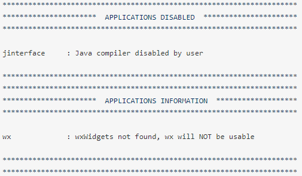
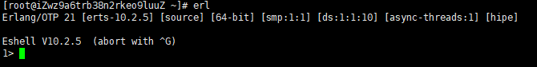

# 在Centos7环境下安装RabbitMq

---
**安装环境**

本次安装基于以下环境安装
* 阿里云
* CentOS 7.3

---
**安装过程**
1、由于RabbitMq是基于Erlang开发的，所以需要先安装Erlang环境
``` sh
# Centos官方镜像尚未更新版本，Erlang版本较老，所以这里使用wget+npm方式安装Erlang环境
# 可以访问 https://packages.erlang-solutions.com/erlang/ 获取最新程序包
# 访问http://erlang.org/download 获取最新源码
wget http://erlang.org/download/otp_src_21.3.tar.gz
#安装相关依赖
sudo yum -y install make gcc gcc-c++ m4 ncurses-devel openssl-devel unixODBC-devel fop wxWidgets
#解压安装包
tar xzf otp_src_19.3.tar.gz
# 创建源bin文件夹
mkdir /usr/local/erlang
# 编译erlang
cd otp_src_19.3
./configure --prefix=/usr/local/erlang --without-javac
```
编译的时候出现以下问题可以忽略



_其中javac的警告可以通过 --without-javac 参数避免;wxWidhets可以通过安装并启用wxWidgets避免_

``` sh
# 安装erlang
make & make install
# 配置sh命令
export PATH=$PATH:/usr/local/erlang/bin
# 安装完成后执行以下命令测试
erl
```


出现如上界面，则说明erlang安装成功
``` erlang
halt() . #退出
```


2、安装RabbitMq
```sh
#下载官方rpm包 https://www.rabbitmq.com/releases/rabbitmq-server/
wget -P /root "https://www.rabbitmq.com/releases/rabbitmq-server/v3.6.15/rabbitmq-server-3.6.15-1.el7.noarch.rpm"
# 导入asc签名
rpm --import https://www.rabbitmq.com/rabbitmq-release-signing-key.asc
# 安装RabbitMq
yum install rabbitmq-server-3.6.15-1.el7.noarch.rpm
# 复制配置文件，方便后续修改相关配置
cp /usr/share/doc/rabbitmq-server-3.6.15/rabbitmq.config.example  /etc/rabbitmq/rabbitmq.config # 该步可以省略，不影响启动
# 启动RabbitMq
systemctl restart rabbitmq-server
# 查看rabbitMq是否启动成功并查看服务器状态
rabbitmqctl status
# 设置rabbitMq 自启动
#######################################
### systemctl enable rabbitmq-server ##
#######################################
```

至此RabbitMq安装完成

---

**配置其他ip访问**

由于RabbitMq，提供默认用户Guest，处于安全因素考虑，Guest用户只能使用localhost访问，同时建议修改Guest用户密码。

所以，如果需要使用外部ip来访问rabbitmq,则需要创建一个新的账号，并为新账号提供远程ip访问的权限。

```sh
# 删除guest用户 建议执行 因为guest是默认用户相对不安全
rabbitmqctl delete_user guest
# 创建用户
rabbitmqctl add_user 用户名 密码
# 赋予用户超级管理员权限
# 用户角色包含
#################################################
## 1、administrator 超级管理员
## 2、monitoring 监控者
## 3、policymaker 策略制定者
## 4、management 普通管理者
## 5、其他 无法登陆管理控制台，生产者和消费者
#################################################
rabbitmqctl set_user_tags 用户名 administrator
# 赋予新创建用户所有权限
rabbitmqctl set_permissions -p / 用户名 ".*" ".*" ".*"
# 启用RabbitMQ的web管理界面
# 因为RabbitMQ默认只允许localhost访问，所以需要启用管理配置组件
rabbitmq-plugins enable rabbitmq_management
```

使用浏览器访问 http://公网ip:15672 可以看到如下界面


> 除此之外，阿里云服务器需要自定义配置防火墙过滤权限，需同时开发5672，15672两个端口的TCP访问权限

至此，外网访问权限配置成功
